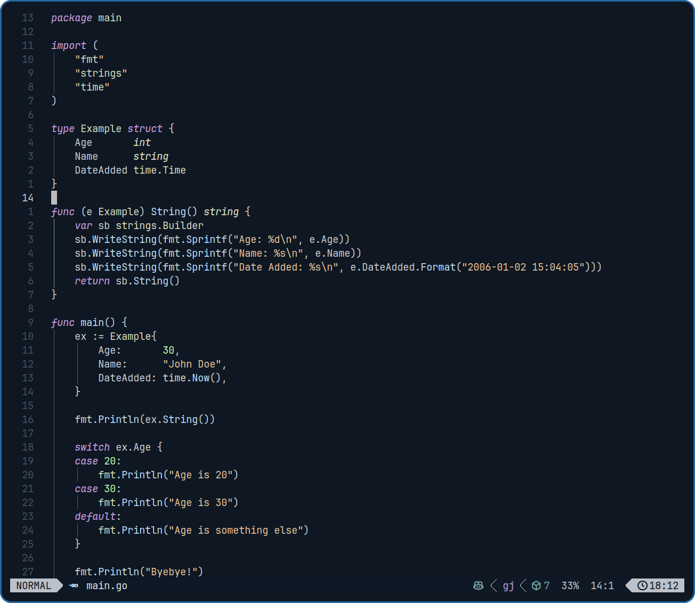

# Magic City Club theme

Simple neovim theme.

## Installation

Just use your favorite plugin manager, for example with lazy nvim:

```lua
 {"pbatomic/magic-city-club-nvim"}
```

## Screenshots

### Lua


### Go



### Python


